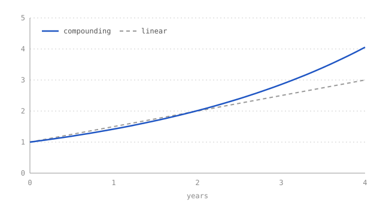

This post is a working cheat sheet.

## Math

Inline math sits inside a sentence, like $e^{i\pi} + 1 = 0$, or the normal density $f(x) = \frac{1}{\sigma\sqrt{2\pi}}\, e^{-\frac{(x-\mu)^2}{2\sigma^2}}$.

Display math gets its own line:

$$
\mathbb{E}[X] = \int_{-\infty}^{\infty} x\, f(x)\, dx
$$

Multi-line derivations align on `&=`:

$$
\begin{aligned}
\operatorname{Var}(X) &= \mathbb{E}\big[(X - \mu)^2\big] \\
                      &= \mathbb{E}[X^2] - \mu^2
\end{aligned}
$$

Everything is rendered when the site is built, so readers get plain HTML and no JavaScript. If you write a dollar amount, escape it as `\$5` so it is not mistaken for math.

## Charts and images

Put the image file in the same folder as the post and reference it by name. The text in the square brackets becomes the caption.



PNGs from matplotlib, Plotly, R, or a screenshot all work the same way. For an interactive chart, export it as an HTML file, drop it in the post folder, and embed it:

```html
<iframe src="my-plot.html" width="100%" height="420"></iframe>
```

## Code

```python
import numpy as np

def compound(rate, years):
    """Growth of one unit at a constant rate."""
    t = np.linspace(0, years, 200)
    return t, np.exp(rate * t)

t, y = compound(0.35, 4)
```

## Tables, footnotes, and the rest

| Rate | 1 year | 4 years |
|-----:|-------:|--------:|
|  10% |   1.11 |    1.49 |
|  35% |   1.42 |    4.06 |

Footnotes are written as `[^1]` in the text and defined anywhere below.[^1] Plain Markdown covers **bold**, *italics*, [links](https://gohugo.io), lists, and quotes.

[^1]: Like this. They collect at the bottom of the post.
